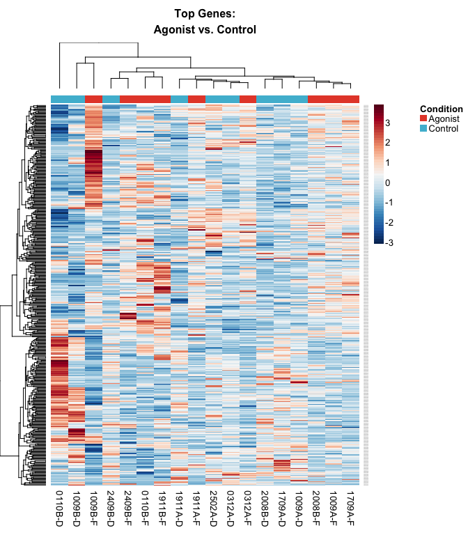

AHR Study
================

-   [Preliminaries](#preliminaries)
-   [Exploratory Data Analysis](#exploratory-data-analysis)
-   [Differential Expression Analysis](#differential-expression-analysis)

All analysis was conducted in R version 3.5.3 using the following script. Computations were performed on a MacBook Pro with 16GB of RAM and an i7 8-core processor.

If you haven't already installed the `bioplotr` package, you'll need to do so to reproduce the figures below.

``` r
# Install bioplotr
devtools::install_github('dswatson/bioplotr')

# Load libraries
library(data.table)
library(tximport)
library(DESeq2)
library(IHW)
library(bioplotr)
library(tidyverse)
library(BiocParallel)
register(MulticoreParam(8))
```

Preliminaries
=============

Following RNA-seqencing of all samples, reads were pseudo-aligned using kallisto ([Bray et al., 2016](http://www.nature.com/nbt/journal/v34/n5/full/nbt.3519.html)). Our reference genome was [GRCh38.p10](http://dec2017.archive.ensembl.org/index.html), Ensembl version 91. Transcript-level reads were aggregated to gene-level using the `tximport` package ([Soneson et al., 2015](https://f1000research.com/articles/4-1521/v2)).

``` r
# Load clinical data
clin <- fread('./Data/clinical.csv')

# Annotation data frame 
anno <- fread('./Data/Hs.anno.csv')

# Transcriptomic data
t2g <- readRDS('./Data/Hs91.t2g.rds')
files <- file.path('./Data/Counts', clin$SampleID, 'abundance.tsv')
txi <- tximport(files, type = 'kallisto', tx2gene = t2g, importer = fread)

# Make DESeqDataSet object
dds <- DESeqDataSetFromTximport(txi, colData = clin, 
                                design = ~ Patient + Condition)
idx <- rownames(dds)
```

Normalization
-------------

Genes are normalised using tools from the `DESeq2` analysis pipeline ([Love et al., 2014](https://genomebiology.biomedcentral.com/articles/10.1186/s13059-014-0550-8)). Specifically, we apply relative log expression (RLE) normalisation to account for library size ([Anders & Huber, 2010](https://genomebiology.biomedcentral.com/articles/10.1186/gb-2010-11-10-r106)).

``` r
# Normalise counts
dds <- estimateSizeFactors(dds)
```

Filtering
---------

Although `DESeq2` has its own internal filtering system for differential expression testing, we apply a separate one here for exploratory data analysis (EDA) and visualisation. Following the recommendations of [Robinson et al. (2010)](https://academic.oup.com/bioinformatics/article/26/1/139/182458), we remove genes with fewer than 1 normalised count in at least 10 libraries. This threshold ensures that each gene is minimally expressed in every condition of the experiment. See the extensive `edgeR` [package vignette](https://www.bioconductor.org/packages/3.3/bioc/vignettes/edgeR/inst/doc/edgeRUsersGuide.pdf) for more details.

``` r
# Extract normalised count matrix
mat <- counts(dds, normalized = TRUE)

# Define expression threshold
keep <- rowSums(mat > 1) >= 10

# How many genes pass the filter?
sum(keep)
```

    ## [1] 19061

The analysis will proceed with 19,061 genes.

Transformation
--------------

We apply the regularised logarithm (rlog) transformation of [Love et al. (2014)](https://genomebiology.biomedcentral.com/articles/10.1186/s13059-014-0550-8) to stabilise variance across the full genomic range. This is helpful for visualisation. See the `DESeq2` [package vignette](http://bioconductor.org/packages/devel/bioc/vignettes/DESeq2/inst/doc/DESeq2.html#regularized-log-transformation) for more details. The function can take a while to execute for large (*n* ≥ 30) datasets.

``` r
# rlog transform
rld <- assay(rlog(dds[keep, ]))
colnames(rld) <- clin$SampleID
```

Exploratory Data Analysis
=========================

We use diagnostic plots and dimensionality reduction techniques to check for outliers, validate our preprocessing pipeline, and search for unsupervised clusters.

Mean-Dispersion Plot
--------------------

Count data are often presumed to follow a negative binomial distribution, which may be uniquely identified by its mean and dispersion parameters. For RNA-seq pipelines that rely on negative binomial generalized linear models (GLMs), such as `edgeR` and `DESeq2`, estimating genewise dispersions is therefore an essential step in the model fitting process. Because there are rarely sufficient replicates to reliably infer these values independently for each gene, both packages use empirical Bayes methods to pool information across genes. This figure displays the prior (black) and posterior (blue) estimates of genewise mean and dispersion parameters following empirical Bayes shrinkage. See the original DESeq papers ([Anders & Huber, 2010](https://genomebiology.biomedcentral.com/articles/10.1186/gb-2010-11-10-r106); [Love et al., 2014](https://genomebiology.biomedcentral.com/articles/10.1186/s13059-014-0550-8)) for more details.

``` r
plot_dispersion(dds[keep, ])
```


This figure looks about right. Note how the model shrinks the observed mean and dispersion of genes in the bottom left up toward the trend line. This is evident from the fact that no blue dots, which represent posterior estimates, are anywhere near those black dots. The so-called outliers (red dots), defined as genes with posterior log dispersion values more than two median absolute deviations from the trend, will be automatically removed during differential expression testing.

Density Plot
------------

Plotting expression densities for all samples is a good way to evaluate the overall skew of the data and visually inspect for outlying samples. We color the curves by subject to observe potential transcriptomic variation across these repeat observations.

``` r
plot_density(rld, group = list(Condition = clin$Condition), 
             xlab = 'rlog Transformed Counts')
```


There are some irregular curves in this density plot, suggesting either that some samples are outliers or that the normalization procedure has failed to smooth out expression patterns across the genome. Further plots will shed some more light.

Sample Similarity Matrix
------------------------

We build a sample similarity matrix by calculating the [pairwise Euclidean distance](https://en.wikipedia.org/wiki/Euclidean_distance_matrix) between all samples in the data. This matrix can then be visualised as a heatmap and used to build a [hierarchical clustering](https://en.wikipedia.org/wiki/Hierarchical_clustering) dendrogram. We annotate the plot with biological and technical covariates.

``` r
plot_similarity(rld, group = list(Condition = clin$Condition, Sex = clin$Sex), 
                covar = list(Age = clin$Age, RIN = clin$RIN),
                pal_covar = c('viridis', 'Spectral'))
```


There are three clear outliers in the top left corner, including one sample that looks especially out of place. To get a closer look at these samples, we look at some projections.

Projections Plots
-----------------

We use a number of dimensionality reduction techniques to visually inspect for outliers and unsupervised clusters.

### PCA

[Principal component analysis (PCA)](https://en.wikipedia.org/wiki/Principal_component_analysis) is a popular linear embedding method dating back to the 1930s.

``` r
plot_pca(rld, group = list(Patient = clin$Patient), label = TRUE)
```


The extreme outlier in the data is 1911B-D. Samples 2502A-F and 2502A-CH also appear quite problematic. Identical results were found for the Salmon data, suggesting this problem does not stem from the pseudo-alignment but rather some more fundamental issue with these samples. We remove them from the data and rerun the PCA.

``` r
# Identify outliers
outliers <- c('1911B-D', '2502A-F', '2502A-CH')

# Remove them from dds and rld objects
clin <- clin[!SampleID %in% outliers]
files <- file.path('./Data/Kallisto', clin$SampleID, 'abundance.tsv')
txi <- tximport(files, type = 'kallisto', tx2gene = t2g, importer = fread)
dds <- DESeqDataSetFromTximport(txi, colData = clin, 
                                design = ~ Patient + Condition)
dds <- estimateSizeFactors(dds)
mat <- counts(dds, normalized = TRUE)
keep <- rowSums(mat > 1) >= 10
rld <- assay(rlog(dds[keep, ]))
```

``` r
# Rerun PCA
plot_pca(rld, group = list(Patient = clin$Patient), label = TRUE)
```


This projection looks much more palatable. We can clearly see samples clustering by patient, which is to be expected. We review several more projections to confirm that the data have stabilized.

### Kernel PCA

Kernel PCA (KPCA) is a nonlinear variant of PCA that uses a Gaussian radial basis function (RBF) kernel to reweight the samples. For details, see [Schölkopf et al., 1998](https://www.mitpressjournals.org/doi/abs/10.1162/089976698300017467).

``` r
plot_kpca(rld, group = list(Patient = clin$Patient), label = TRUE)
```


This plot is fairly similar to the linear PCA.

### t-SNE

Another popular nonlinear embedding technique is [t-distributed stochastic neighbour embedding (t-SNE)](https://en.wikipedia.org/wiki/T-distributed_stochastic_neighbor_embedding).

``` r
plot_tsne(rld, group = list(Patient = clin$Patient), label = TRUE)
```


The t-SNE plot suggests a somewhat more uniform spread of the data, although with similar overall trends.

Drivers
-------

We visualise the relationships between phenotypic variables and the top principal components of the expression matrix as a heatmap. This plot helps determine the top drivers of variation in the transcriptomic data. We use subject as a blocking variable to account for repeat observations. Tiles are outlined if the *p*-value of the association test is ≤ 0.05 following FDR correction ([Benjamini & Hochberg, 1995](http://www.stat.purdue.edu/~doerge/BIOINFORM.D/FALL06/Benjamini%20and%20Y%20FDR.pdf)).

``` r
tmp <- clin %>% select(SampleID, Patient, Condition, Sex, Age, RIN)
plot_drivers(rld, tmp, index = 'SampleID', block = 'Patient', unblock = 'Age', 
             alpha = 0.05, p.adj = 'fdr', n.pc = 10)
```


This plot immediately reveals some clear structure in the data. First of all, as indicated by the projections, Patient is way and by far the greatest driver of omic variation. But even controlling for Patient as a blocking variable, several significant associations remain between top PCs and recorded covariates like Condition and Sex. Age is less predictive, although RIN is correlated with PCs 2-4, suggesting that read integrity accounts for some of the variance in gene expression.

Differential Expression Analysis
================================

The `results` and `lfcShrink` functions have been separated within the `DESeq2` package while the authors experiment with new adaptive shrinkage techniques. This makes it a little clunky to test multiple hypotheses, as we do here. I've written a custom wrapper to standardise model outputs. We use independent hypothesis weighting for internal gene filtering and *p*-value adjustment ([Ignatiadis et al., 2016](https://www.ncbi.nlm.nih.gov/pubmed/27240256)), with a target FDR of 5%.

``` r
# Prepare gene index and gene name table
idx <- rownames(dds)
e2g <- t2g %>% 
  select(gene_id, gene_name) %>%
  distinct(.)

# Export function
output <- function(trt) {
  lfc <- lfcShrink(dds, contrast = c('Condition', trt, 'Control'),
                   parallel = TRUE, quiet = TRUE) %>%
    as_tibble(.) %>%
    mutate(gene_id = idx) %>%
    rename(logFC = log2FoldChange) %>%
    select(gene_id, logFC)
  res <- results(dds, contrast = c('Condition', trt, 'Control'), tidy = TRUE, 
                 filterFun = ihw, alpha = 0.05) %>%
    na.omit(.) %>%
    mutate(AvgExpr = log2(baseMean)) %>%
    rename(gene_id = row, 
           p.value = pvalue,
           q.value = padj) %>%
    inner_join(lfc, by = 'gene_id') %>%
    inner_join(e2g, by = 'gene_id') %>% 
    rename(EnsemblID = gene_id, GeneName = gene_name) %>%
    arrange(p.value) %>%
    select(EnsemblID, GeneName, AvgExpr, logFC, p.value, q.value)
  return(res)
}
```

We test for paired differences between (1) agonist vs. control and (2) antagonist vs. control. For both tests, we create the same trio of figures: a mean-difference plot, a volcano plot, and a heatmap visualising results for the top 1000 genes.

``` r
# Fit the model
dds <- DESeq(dds, parallel = TRUE)
```

Agonist vs. Control
-------------------

How many genes are differentially expressed between agonist and control at 5% FDR?

``` r
res_h1 <- output('Agonist')
```

``` r
sum(res_h1$q.value <= 0.05)
```

    ## [1] 53

We visualise these results with the aforementioned trio of figures.

``` r
# Mean-difference plot
plot_md(res_h1, probes = 'EnsemblID',
        title = 'Mean-Difference Plot:\nAgonist vs. Control')
```


``` r
# Volcano plot
plot_volcano(res_h1, probes = 'EnsemblID', y = 'p',
             title = 'Volcano Plot:\nAgonist vs. Control')
```


The mean-difference and volcano plots suggest a fairly symmetric distribution of significant genes across the transcriptomic range.

``` r
# Filter top 1k genes
top_genes <- res_h1$EnsemblID[seq_len(500)]

# Filter out antagonist samples
tmp <- clin[Condition != 'Antagonist']
mat <- rld[rownames(rld) %in% top_genes, tmp$SampleID]

# Create heatmap
plot_heatmap(mat, group = list(Condition = tmp$Condition),
             title = 'Top Genes:\nAgonist vs. Control')
```



The two groups do not separate very neatly in this heatmap, suggesting that the differential expression between the conditions is not especially strong, at least not in the top 500 genes.

Antagonist vs. Control
----------------------

How many genes are differentially expressed between antagonist and control at 5% FDR?

``` r
res_h2 <- output('Antagonist')
```

``` r
sum(res_h2$q.value <= 0.05)
```

    ## [1] 166

This signal is considerably stronger than the one we found in the previous comparison. Results are visualized below.

``` r
# Mean-difference plot
plot_md(res_h2, probes = 'EnsemblID',
        title = 'Mean-Difference Plot:\nAntagonist vs. Control')
```


``` r
# Volcano plot
plot_volcano(res_h2, probes = 'EnsemblID', y = 'p',
             title = 'Volcano Plot:\nAntagonist vs. Control')
```


The mean-difference and volcano plots suggest a fairly symmetric distribution of significant genes across the transcriptomic range.

``` r
# Filter top 1k genes
top_genes <- res_h2$EnsemblID[seq_len(500)]

# Filter out antagonist samples
tmp <- clin[Condition != 'Agonist']
mat <- rld[rownames(rld) %in% top_genes, tmp$SampleID]

# Create heatmap
plot_heatmap(mat, group = list(Condition = tmp$Condition),
             title = 'Top Genes:\nAntagonist vs. Control')
```


Separation across the conditions is still imperfect, but somewhat stronger than in the agonist vs. control test.
